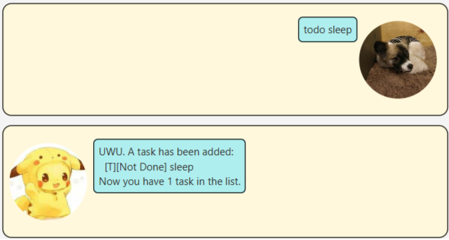
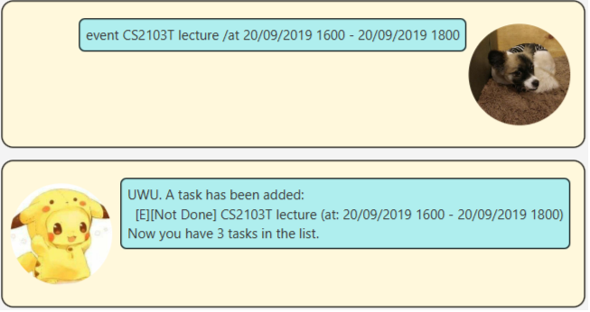
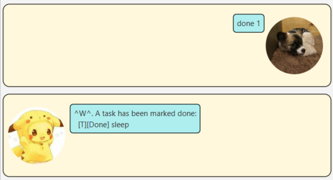
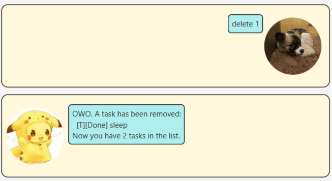
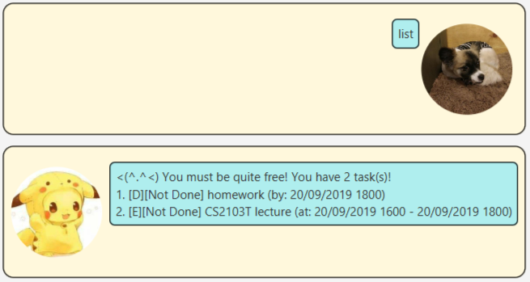
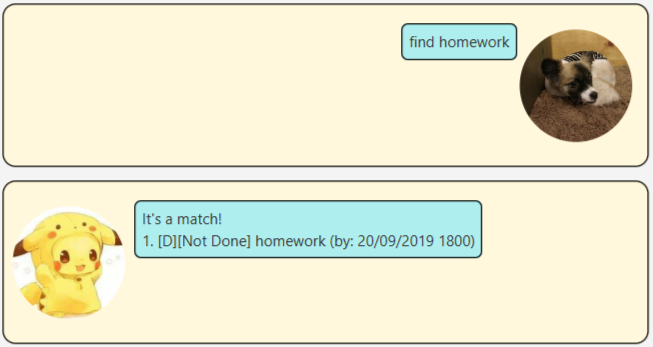
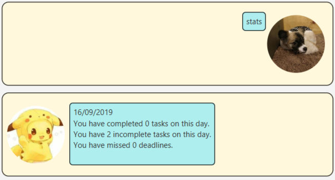

# User Guide
Duke is a command line application for you to keep track of your tasks.

## Features 

### Feature 1: Task Tracking
In Duke, tasks are categorised into 3 main types:

1. `Todo`
    * A task which you intend to do.
2. `Deadline`
    * A task which you intend to complete before a particular date.
3. `Event`
    * A task which the you intend to attend between 2 dates.

Tasks can be added or deleted in Duke. You can also mark your tasks as done
and ask for the list of tasks that are currently tracked by Duke.

Dates in Duke are of the format `dd/MM/yyyy HHmm` where `HHmm` denotes the time in 24-hour format.

### Feature 2: Statistics
Duke is able to help you to keep track of the following statistics:

1. Number of tasks you completed on each day
2. Number of tasks you did not complete on each day
3. Number of deadlines you have missed on each day

## Usage

### 1. `todo <task>` - Adds a `Todo` task

This command helps you to add a `Todo` task with the name `<task>` into Duke.

`Todo` tasks are denoted by `[T]` in Duke.

Example of usage: 

`todo sleep`

Expected outcome:

```
UWU. A task has been added:
  [T][Not Done] sleep
Now you have 1 task in the list.
```
Image example:



### 2. `deadline <task> /by dd/MM/yyyy HHmm` - Adds a `Deadline` task

This command helps you to add `Deadline` task with `<task>` as description and 
`dd/MM/yyyy HHmm` as the deadline. 

`Deadline` tasks are denoted by `[D]` in Duke.

Example of usage:

`deadline homework /by 20/09/2019 1800`

Expected outcome:

```
UWU. A task has been added:
  [D][Not Done] homework (by: 20/09/2019 1800)
Now you have 2 tasks in the list.
```

Image example:


### 3. `event <task> /at dd/MM/yyyy HHmm - dd/MM/yyyy HHmm` - Adds an `Event` task

This command helps you to add an `Event` task with `<task>` as the task name. The first
date is the start date of the event while the second date is the end date of the event.

`Event` tasks are denoted by `[E]` in Duke.

Example of usage:

`event CS2103T lecture /at 20/09/2019 1600 - 20/09/2019 1800`

Expected outcome:

```
UWU. A task has been added:
  [E][Not Done] CS2103T Lecture (at: 20/09/2019 1600 - 20/09/2019 1800)
Now you have 3 tasks in the list.
```

Image example:



### 4. `done <index>` - Marks task as done
This helps you to mark the task at `<index>` as done. If there are no tasks existing at
`<index>`, Duke will inform you about it.

Example of usage:

`done 1`

Expected outcome:

```
^W^. A task has been marked done:
  [T][Done] sleep
```

Image example:



### 5. `delete <index>` - Deletes task
This helps you to delete the task at `<index>`. If there are no tasks existing at `<index>`, 
Duke will inform you abut it.

Example of usage:

`delete 1`

Expected outcome:

```
OWO. A task has been removed:
  [T][Done] sleep
Now you have 2 tasks in the list
```

Image example:



### 6. `list` - Lists all the tasks
This command will list out all of the tasks that you have entered into Duke. 
Deleted tasks will not be listed.

Example of usage:

`list`

Expected outcome:

```
<(^.^<) You must be quite free! You have 2 task(s)!
1. [D][Not Done] homework (by: 20/09/2019 1800)
2. [E][Not Done] CS2103T lecture (at: 20/09/2019 1600 - 20/09/2019 1800)
```

Image example:



### 7. `find <keyword>` - Finds all tasks with the keyword
This command will help you to find all of the tasks in Duke that contain the given `<keyword>`.
If there are any matches, Duke will print out the matches. If no matches are found, Duke will inform
you about it.

Example of usage:

`find homework`

Expected outcome:

```
It's a match!
1. [D][Not Done] homework (by: 20/09/2019 1800)
```

Image example:



### 8. `stats` - Print out statistics
This command will print out all the statistics that Duke has been keeping track of.
Only statistics that are at most 6 days old will be printed. 

If a deadline is missed while Duke is active, this missed deadline will only be updated
when Duke is relaunched. 

Example of usage:

`stats`

Expected outcome:

```
16/09/2019
You have completed 0 tasks on this day.
You have 2 incomplete tasks on this day.
You have missed 0 deadlines.
```

Image example:



### 9. `bye` - Exits Duke
This command will help to store all the tasks that you have entered in Duke. After which,
the Duke application will close.

Example of usage:

`bye`

## Credits
The Pikachu image is adapted from [zerochan](https://www.zerochan.net/1659646).